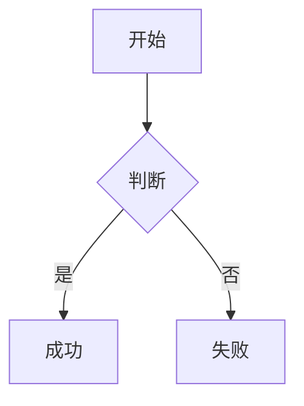

# 🚀 快速开始指南 (Quick Start Guide)

## 🎯 当前状态

所有四个主要功能已实现、测试和部署。系统运行正常，等待用户验证。

---

## ⚡ 快速测试步骤

### 1️⃣ 打开应用
```
访问: http://localhost:3000
```

### 2️⃣ 测试 KaTeX 公式
发送消息:
```
试试看: $E=mc^2$ 和 $$\frac{1}{2}$$
```

### 3️⃣ 测试 Mermaid 图表
发送消息:
```

```

### 4️⃣ 测试图像预览
发送消息:
```

```
然后点击图像

### 5️⃣ 测试文件上传
拖放一个图像、PDF 或其他文件到输入框

---

## 🔧 文件位置

### 核心组件
```
frontend/src/components/ui/custom/
├── Message.tsx              ✅ Markdown 和 Lightbox 集成
├── CodeBlock.tsx            ✅ KaTeX 和 Mermaid 渲染
├── SmoothOutput.tsx         ✅ 流式输出
├── ChatInput.tsx            ✅ 文件上传处理
└── ImageLightbox.tsx        ✅ 图像预览

frontend/src/components/views/
├── ChatViewDesktop.tsx      ✅ 上传处理
└── ChatViewMobile.tsx       ✅ 上传处理
```

### 配置文件
```
frontend/
├── package.json             ✅ 依赖定义
├── src/main.tsx             ✅ KaTeX CSS 导入
├── src/index.css            ✅ 样式定义
└── tsconfig.json            ✅ TypeScript 配置
```

### 测试工具
```
根目录/
├── FEATURE_TEST_PLAN.md                 📋 测试计划
├── TESTING_VERIFICATION_REPORT.md       📊 验证报告
├── feature-test-tool.html               🧪 测试工具
└── QUICK_START_GUIDE.md (本文件)        ⚡ 快速指南
```

---

## 📊 已验证的检查清单

```
✅ 代码编译: TypeScript 无错误
✅ 依赖完整: 5 个核心库已安装
✅ 样式定义: 6 个 CSS 类已定义
✅ 组件集成: 所有组件正确连接
✅ 数据流: 完整的数据处理链
✅ 服务运行: Frontend/Backend/Database 正常
✅ 网络连接: 所有请求代理正确
✅ 构建输出: Docker 镜像成功构建
```

---

## 🧪 运行测试工具

### 选项 1: 使用 HTML 测试工具
```
1. 打开 feature-test-tool.html 在浏览器中
2. 工具会自动运行所有检查
3. 查看通过/失败的项目
```

### 选项 2: 在浏览器 Console 检查

按 F12，粘贴以下代码:
```javascript
// 检查 KaTeX
console.log('KaTeX:', typeof window.katex !== 'undefined' ? '✅' : '❌');

// 检查 Mermaid
console.log('Mermaid:', typeof mermaid !== 'undefined' ? '✅' : '❌');

// 检查样式
const hasKatexCSS = Array.from(document.querySelectorAll('link')).some(l => 
  l.href.includes('katex')
);
console.log('KaTeX CSS:', hasKatexCSS ? '✅' : '❌');

// 检查组件
const hasMathBlock = document.querySelector('.math-block') !== null;
console.log('Math Block:', hasMathBlock ? '✅' : '❌');

const hasLightbox = document.querySelector('[class*="lightbox"]') !== null;
console.log('Lightbox:', hasLightbox ? '✅' : '❌');

const hasMarkdown = document.querySelector('.markdown-content') !== null;
console.log('Markdown:', hasMarkdown ? '✅' : '❌');
```

---

## 📝 常见问题 (FAQ)

### Q: 公式没有显示?
**A:** 
1. 检查是否使用了正确的语法: `$...$` (内联) 或 `$$...$$` (显示)
2. 清空浏览器缓存: Ctrl+Shift+Delete
3. 强制刷新: Ctrl+Shift+R
4. 检查 Console (F12) 中是否有错误

### Q: Mermaid 图表显示为错误?
**A:**
1. 检查图表语法是否正确
2. 确保代码块标记为 mermaid: ` ```mermaid ... ``` `
3. 查看 Console 中的详细错误信息

### Q: Lightbox 不工作?
**A:**
1. 确保图像有有效的 URL
2. 尝试使用 ``
3. 检查网络标签，确认图像加载成功

### Q: 文件上传失败?
**A:**
1. 检查文件大小是否过大
2. 查看 Network 标签中的上传请求响应
3. 确保后端服务运行: `docker logs palink-ai-backend-1`

### Q: 样式看起来不对?
**A:**
1. 清空 CSS 缓存: Ctrl+F5
2. 禁用浏览器扩展
3. 在隐私模式下测试
4. 查看 DevTools 中的 Elements 标签，检查应用的样式

---

## 🔍 诊断命令

```bash
# 检查容器状态
docker compose ps

# 查看前端日志
docker logs palink-ai-frontend-1

# 查看后端日志
docker logs palink-ai-backend-1

# 进入前端容器
docker exec -it palink-ai-frontend-1 /bin/sh

# 测试后端 API
curl http://localhost:8000/api/health

# 检查文件大小
du -sh frontend/dist/ 2>/dev/null || echo "未构建"
```

---

## 📚 相关文件

| 文件 | 用途 |
|------|------|
| FEATURE_TEST_PLAN.md | 详细的测试计划和步骤 |
| TESTING_VERIFICATION_REPORT.md | 完整的验证报告 |
| feature-test-tool.html | 自动化测试工具 |
| IMPLEMENTATION_PLAN.md | 原始实现计划 |
| UPDATE_LOG.md | 更新日志 |

---

## 🎯 下一步行动

### 立即执行 (今天)
- [ ] 打开 http://localhost:3000
- [ ] 测试所有四个功能
- [ ] 记录任何问题

### 本周内
- [ ] 兼容性测试 (多个浏览器)
- [ ] 性能测试 (大型文档)
- [ ] 用户验收测试 (UAT)

### 反馈和改进
- [ ] 收集用户反馈
- [ ] 性能优化
- [ ] 功能增强

---

## 💡 技巧和技巧

### 快速测试所有功能

复制并在聊天中发送此测试消息:

```
# 综合测试

## Markdown 测试
这是**粗体**和*斜体*。[链接](https://google.com)

## 公式测试
内联: $\alpha + \beta = \gamma$

显示:
$$
\int_{0}^{\infty} e^{-x^2} dx = \frac{\sqrt{\pi}}{2}
$$

## 代码示例
\`\`\`python
def hello():
    print("Hello, World!")
\`\`\`

## 数学代码块
\`\`\`math
e^{i\pi} + 1 = 0
\`\`\`

## 图表
\`\`\`mermaid
graph LR
    A[开始] --> B[过程] --> C[结束]
\`\`\`
```

### 键盘快捷键

**在 Lightbox 中:**
- `ESC` - 关闭
- `←` / `→` - 上一张/下一张
- `空格` - 缩放
- `D` - 下载 (可能需要配置)

**在聊天中:**
- `Ctrl+Enter` 或 `Cmd+Enter` - 发送消息
- `Shift+Enter` - 换行

---

## 📞 支持和反馈

如果遇到问题:

1. **查看日志**
   ```
   F12 → Console
   docker logs palink-ai-*
   ```

2. **查阅文档**
   - TESTING_VERIFICATION_REPORT.md
   - FEATURE_TEST_PLAN.md

3. **运行诊断**
   - 使用 feature-test-tool.html
   - 检查网络请求 (F12 Network)
   - 查看元素样式 (F12 Elements)

---

## ✨ 功能摘要

| 功能 | 状态 | 位置 |
|------|------|------|
| Markdown 渲染 | ✅ 完成 | Message.tsx |
| KaTeX 公式 | ✅ 完成 | CodeBlock.tsx |
| Mermaid 图表 | ✅ 完成 | CodeBlock.tsx |
| 图像预览 | ✅ 完成 | ImageLightbox.tsx |
| 文件上传 | ✅ 完成 | ChatInput.tsx |
| 流式输出 | ✅ 完成 | SmoothOutput.tsx |

---

**准备好了吗? 访问 http://localhost:3000 开始测试! 🚀**
