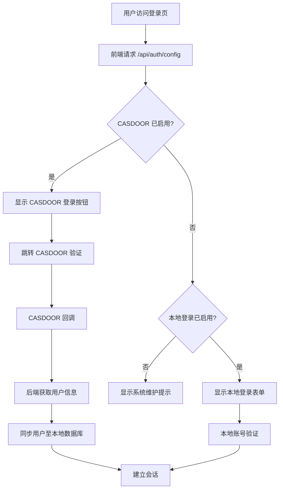
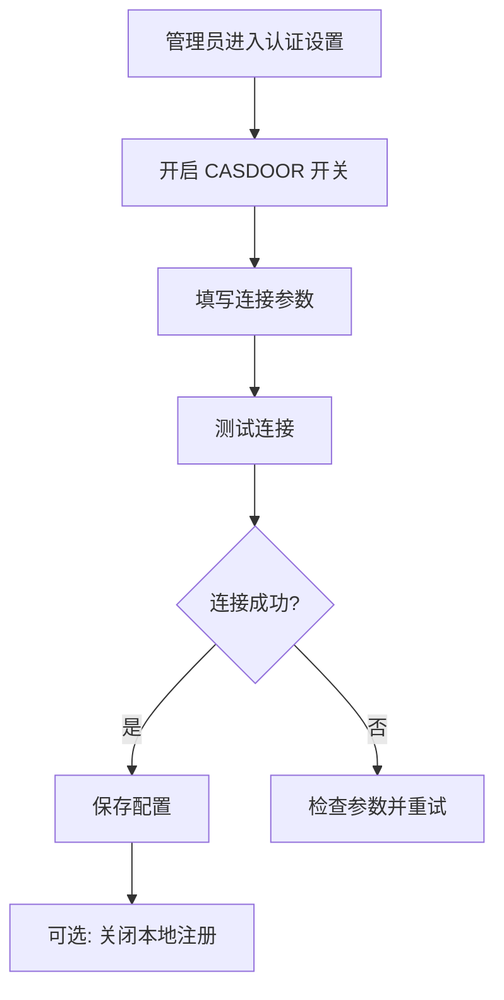

# CASDOOR 统一身份认证集成 PRD

## 1. Product Overview

Palink-AI 需在现有本地登录基础上接入已部署的 CASDOOR 统一身份认证系统，管理员可在设置面板中动态配置登录方式，无需修改环境变量或重启服务。

- 解决当前本地注册缺少验证、账号分散管理的问题
- 适配公网 CASDOOR 服务器与内网 NAS 部署的多服务器场景
- 管理员可通过 UI 动态开关 CASDOOR 登录、本地登录、本地注册

## 2. Core Features

### 2.1 User Roles

| Role | Registration Method | Core Permissions |
|------|---------------------|------------------|
| Admin | CASDOOR 或本地登录 | 管理认证配置、用户管理、全部功能 |
| Normal User | CASDOOR 注册 | 使用 Palink-AI 全部功能 |

### 2.2 Feature Module

1. **管理员认证设置页**: 在设置面板中新增"认证设置"tab，动态配置登录方式
2. **登录页面改造**: 根据 CASDOOR 配置动态显示登录选项
3. **用户数据同步**: CASDOOR 登录后自动同步用户信息至本地数据库

### 2.3 Page Details

| Page Name | Module Name | Feature description |
|-----------|-------------|---------------------|
| 设置 > 认证设置 | CASDOOR 开关 | 启用/禁用 CASDOOR 登录，配置连接参数 |
| 设置 > 认证设置 | 本地登录开关 | 启用/禁用本地密码登录（降级备用） |
| 设置 > 认证设置 | 本地注册开关 | 启用/禁用本地注册（CASDOOR 启用时建议关闭） |
| 设置 > 认证设置 | 连接测试 | 测试 CASDOOR 服务连通性 |
| 设置 > 认证设置 | CASDOOR 配置表单 | 填写 endpoint、clientId、clientSecret 等参数 |
| 登录页面 | CASDOOR 登录按钮 | 跳转至 CASDOOR 完成身份验证 |
| 登录页面 | 本地登录表单 | CASDOOR 未启用或不可用时显示 |
| 后端服务 | 用户同步 | CASDOOR 登录成功后同步用户数据 |

## 3. Core Process

### 3.1 管理员配置流程

1. 管理员进入 设置 > 认证设置
2. 开启 CASDOOR 登录开关
3. 填写 CASDOOR 连接参数（endpoint、clientId、clientSecret 等）
4. 点击"测试连接"验证配置
5. 连接成功后保存配置
6. 可选择关闭本地注册（推荐）

### 3.2 CASDOOR 登录流程

1. 用户访问登录页，前端请求 `/api/auth/config` 获取当前认证配置
2. CASDOOR 已启用且可用时，显示 CASDOOR 登录按钮
3. 用户点击 CASDOOR 登录，跳转至 CASDOOR 服务
4. CASDOOR 验证成功后回调至 Palink-AI
5. 后端使用授权码获取 CASDOOR 用户信息
6. 同步用户数据至本地数据库（通过 casdoor_id 关联）
7. 建立本地会话，用户进入系统

### 3.3 本地登录降级流程

1. CASDOOR 未启用或服务不可用时，显示本地登录表单
2. 用户使用本地账号密码登录
3. 建立本地会话

### 3.4 Mermaid 流程图





## 4. User Interface Design

### 4.1 Design Style

- 保持与现有 Palink-AI 设置面板一致的设计风格
- 使用项目现有的 GlassCard、Switch、Button、Input 组件
- 配色与现有管理员设置 tab 统一

### 4.2 Page Design Overview

#### 管理员认证设置页

| Module Name | UI Elements |
|-------------|-------------|
| CASDOOR 登录开关 | Switch 开关 + 说明文字 |
| CASDOOR 配置表单 | Input 输入框组（endpoint、clientId、clientSecret、organizationName、applicationName） |
| 连接测试 | Button 按钮 + 状态指示器 |
| 本地登录开关 | Switch 开关 + 说明文字 |
| 本地注册开关 | Switch 开关 + 说明文字 |
| 保存按钮 | Button 主按钮 |

#### 登录页面

| Module Name | UI Elements |
|-------------|-------------|
| CASDOOR 登录按钮 | 主按钮，突出显示，位于表单上方 |
| 分隔线 | "或" 文字分隔 |
| 本地登录表单 | 现有用户名/密码表单 |

### 4.3 认证设置 Tab 在设置面板中的位置

在现有管理员菜单中，位于"用户管理"和"系统默认"之间：

```
设置面板侧边栏：
├── 个人资料
├── 原创角色(OC)
├── 外观与语言
├── 提示词
├── 模型管理          (管理员)
├── 用户管理          (管理员)
├── 认证设置          (管理员) ← 新增
├── 系统默认          (管理员)
├── 用量统计
└── 关于
```

### 4.4 Responsiveness

- 保持现有设置面板的响应式设计
- CASDOOR 配置表单在移动端垂直排列，桌面端可横向排列
- 登录页 CASDOOR 按钮在移动端和桌面端均正常显示

## 5. 配置优先级

CASDOOR 配置支持两种来源，优先级从高到低：

1. **数据库配置**（管理员通过 UI 设置）— 优先级最高，修改即时生效
2. **环境变量配置**（.env 文件）— 作为初始默认值，数据库无配置时回退使用

这种设计确保：
- 首次部署可通过环境变量快速配置
- 运行时管理员可通过 UI 动态调整，无需重启服务
