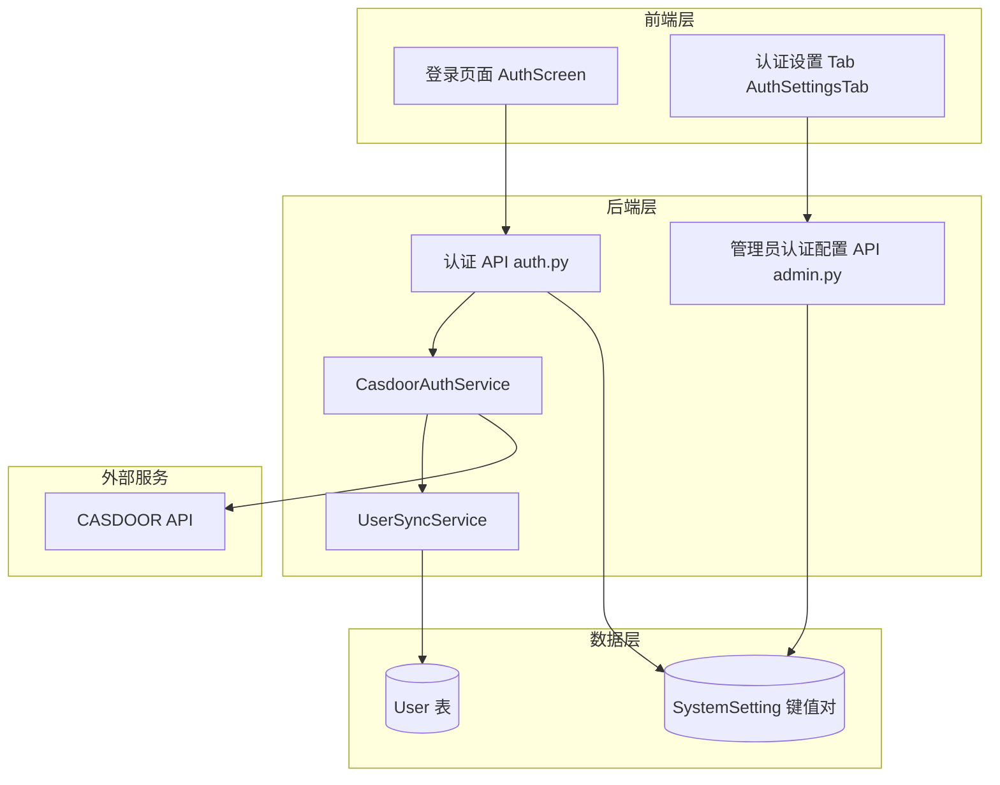
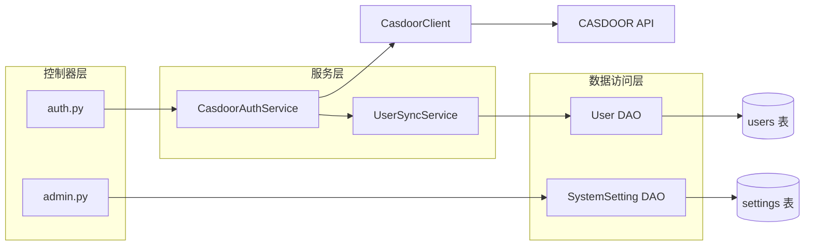
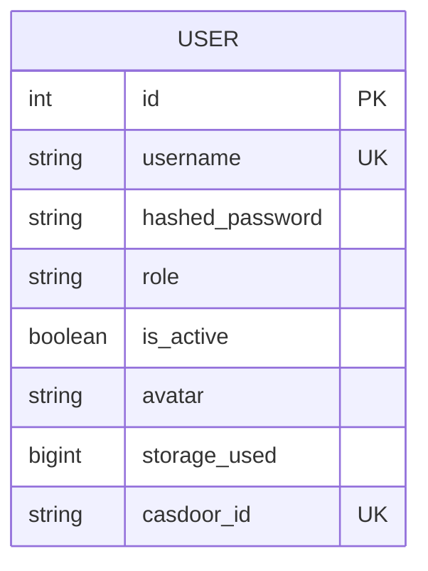

# CASDOOR 统一身份认证集成 技术架构

## 1. Architecture Design



## 2. Technology Description

- Frontend: React@18 + tailwindcss@3 + vite（现有技术栈不变）
- Backend: Python FastAPI（现有技术栈不变）
- Database: SQLite / PostgreSQL（现有数据库不变，通过 Alembic 迁移添加字段）
- 外部服务: CASDOOR 统一身份认证系统
- 配置存储: 复用现有 `SystemSetting` 键值对模型（与 web_search、image_cleanup 等配置模式一致）

## 3. Route Definitions

### 前端路由

| Route | Purpose |
|-------|---------|
| /settings (认证设置 tab) | 管理员配置 CASDOOR 连接参数和登录方式开关 |
| /auth/callback | CASDOOR OAuth2 回调页面 |

### 后端 API

| Route | Method | Purpose | Auth |
|-------|--------|---------|------|
| /api/auth/config | GET | 获取当前认证配置（前端登录页使用） | 无 |
| /api/auth/casdoor/login-url | GET | 获取 CASDOOR 登录跳转 URL | 无 |
| /api/auth/casdoor/callback | GET | CASDOOR OAuth2 回调处理 | 无 |
| /api/admin/auth/config | GET | 获取完整认证配置（含敏感信息） | Admin |
| /api/admin/auth/config | POST | 保存认证配置 | Admin |
| /api/admin/auth/test-casdoor | POST | 测试 CASDOOR 连接 | Admin |

## 4. API Definitions

### 4.1 前端公开接口（登录页使用）

```typescript
interface AuthConfig {
  casdoor_enabled: boolean;
  local_login_enabled: boolean;
  local_register_enabled: boolean;
  casdoor_endpoint: string;
  casdoor_organization_name: string;
  casdoor_application_name: string;
  casdoor_redirect_uri: string;
}

interface CasdoorLoginUrlResponse {
  login_url: string;
  state: string;
}

interface CasdoorCallbackResponse {
  access_token: string;
  token_type: string;
}
```

### 4.2 管理员配置接口

```typescript
interface AdminAuthConfig {
  casdoor_enabled: boolean;
  local_login_enabled: boolean;
  local_register_enabled: boolean;
  casdoor_endpoint: string;
  casdoor_client_id: string;
  casdoor_client_secret: string;
  casdoor_certificate: string;
  casdoor_organization_name: string;
  casdoor_application_name: string;
  casdoor_redirect_uri: string;
}

interface CasdoorTestResult {
  success: boolean;
  message: string;
}
```

### 4.3 Python 类型定义

```python
from pydantic import BaseModel
from typing import Optional

class AuthConfigPublic(BaseModel):
    casdoor_enabled: bool = False
    local_login_enabled: bool = True
    local_register_enabled: bool = True
    casdoor_endpoint: str = ""
    casdoor_organization_name: str = ""
    casdoor_application_name: str = ""
    casdoor_redirect_uri: str = ""

class AdminAuthConfig(BaseModel):
    casdoor_enabled: bool = False
    local_login_enabled: bool = True
    local_register_enabled: bool = True
    casdoor_endpoint: str = ""
    casdoor_client_id: str = ""
    casdoor_client_secret: str = ""
    casdoor_certificate: str = ""
    casdoor_organization_name: str = ""
    casdoor_application_name: str = ""
    casdoor_redirect_uri: str = ""

class CasdoorTestRequest(BaseModel):
    endpoint: str
    client_id: str
    client_secret: str
    certificate: str
    organization_name: str
    application_name: str
```

## 5. Server Architecture Diagram



## 6. Data Model

### 6.1 SystemSetting 配置项

复用现有 `SystemSetting` 模型，新增 key 为 `auth_config` 的记录：

```python
class SystemSetting(Base):
    __tablename__ = "settings"
    key = Column(String, primary_key=True)
    value = Column(String)
```

存储的 JSON 结构：

```json
{
  "casdoor_enabled": false,
  "local_login_enabled": true,
  "local_register_enabled": true,
  "casdoor_endpoint": "",
  "casdoor_client_id": "",
  "casdoor_client_secret": "",
  "casdoor_certificate": "",
  "casdoor_organization_name": "",
  "casdoor_application_name": "",
  "casdoor_redirect_uri": ""
}
```

### 6.2 User 表变更



### 6.3 数据库迁移脚本

```python
"""add casdoor_id to users table

Revision ID: 0019_add_casdoor_id
"""
from alembic import op
import sqlalchemy as sa

def upgrade() -> None:
    op.add_column('users', sa.Column('casdoor_id', sa.String(255), nullable=True))
    op.create_index('ix_users_casdoor_id', 'users', ['casdoor_id'], unique=True)

def downgrade() -> None:
    op.drop_index('ix_users_casdoor_id', table_name='users')
    op.drop_column('users', 'casdoor_id')
```

### 6.4 User Model 变更

在 [user.py](file:///C:/Users/Pall/OneDrive/%E6%A1%8C%E9%9D%A2/Palink-AI/backend/app/models/user.py) 的 `User` 类中新增：

```python
casdoor_id = Column(String(255), unique=True, index=True, nullable=True)
```

## 7. 配置优先级机制

```python
def get_auth_config(db: Session) -> dict:
    setting = db.query(SystemSetting).filter(SystemSetting.key == "auth_config").first()
    if setting:
        try:
            return json.loads(setting.value)
        except (json.JSONDecodeError, TypeError):
            pass

    return {
        "casdoor_enabled": os.getenv("CASDOOR_ENABLED", "false").lower() == "true",
        "local_login_enabled": os.getenv("LOCAL_LOGIN_ENABLED", "true").lower() == "true",
        "local_register_enabled": os.getenv("LOCAL_REGISTER_ENABLED", "true").lower() == "true",
        "casdoor_endpoint": os.getenv("CASDOOR_ENDPOINT", ""),
        "casdoor_client_id": os.getenv("CASDOOR_CLIENT_ID", ""),
        "casdoor_client_secret": os.getenv("CASDOOR_CLIENT_SECRET", ""),
        "casdoor_certificate": os.getenv("CASDOOR_CERTIFICATE", ""),
        "casdoor_organization_name": os.getenv("CASDOOR_ORGANIZATION_NAME", ""),
        "casdoor_application_name": os.getenv("CASDOOR_APPLICATION_NAME", ""),
        "casdoor_redirect_uri": os.getenv("CASDOOR_REDIRECT_URI", ""),
    }
```

## 8. 核心实现要点

### 8.1 后端 API 实现

#### 8.1.1 公开认证配置接口

```python
@router.get("/api/auth/config")
async def get_auth_config_public(db: Session = Depends(get_db)):
    config = get_auth_config(db)
    return {
        "casdoor_enabled": config.get("casdoor_enabled", False),
        "local_login_enabled": config.get("local_login_enabled", True),
        "local_register_enabled": config.get("local_register_enabled", True),
        "casdoor_endpoint": config.get("casdoor_endpoint", ""),
        "casdoor_organization_name": config.get("casdoor_organization_name", ""),
        "casdoor_application_name": config.get("casdoor_application_name", ""),
        "casdoor_redirect_uri": config.get("casdoor_redirect_uri", ""),
    }
```

#### 8.1.2 管理员认证配置接口

```python
@router.get("/api/admin/auth/config")
async def get_admin_auth_config(user: User = Depends(get_admin), db: Session = Depends(get_db)):
    config = get_auth_config(db)
    return config

@router.post("/api/admin/auth/config")
async def save_admin_auth_config(
    config: AdminAuthConfig,
    user: User = Depends(get_admin),
    db: Session = Depends(get_db),
):
    setting = db.query(SystemSetting).filter(SystemSetting.key == "auth_config").first()
    value = json.dumps(config.model_dump())
    if setting:
        setting.value = value
    else:
        db.add(SystemSetting(key="auth_config", value=value))
    db.commit()
    return {"status": "ok"}
```

#### 8.1.3 CASDOOR 连接测试接口

```python
@router.post("/api/admin/auth/test-casdoor")
async def test_casdoor_connection(
    req: CasdoorTestRequest,
    user: User = Depends(get_admin),
):
    try:
        import httpx
        async with httpx.AsyncClient(timeout=10.0) as client:
            resp = await client.get(f"{req.endpoint.rstrip('/')}/api/get-app")
            if resp.status_code == 200:
                return {"success": True, "message": "CASDOOR 连接成功"}
            return {"success": False, "message": f"CASDOOR 返回状态码 {resp.status_code}"}
    except Exception as e:
        return {"success": False, "message": f"连接失败: {str(e)}"}
```

#### 8.1.4 CASDOOR 登录流程

```python
@router.get("/api/auth/casdoor/login-url")
async def get_casdoor_login_url(db: Session = Depends(get_db)):
    config = get_auth_config(db)
    if not config.get("casdoor_enabled"):
        raise HTTPException(status_code=400, detail="CASDOOR login is not enabled")

    state = secrets.token_urlsafe(32)
    login_url = (
        f"{config['casdoor_endpoint'].rstrip('/')}/login/oauth/authorize"
        f"?client_id={config['casdoor_client_id']}"
        f"&response_type=code"
        f"&redirect_uri={config['casdoor_redirect_uri']}"
        f"&scope=read"
        f"&state={state}"
        f"&organization={config['casdoor_organization_name']}"
        f"&application={config['casdoor_application_name']}"
    )
    return {"login_url": login_url, "state": state}

@router.get("/api/auth/casdoor/callback")
async def casdoor_callback(
    code: str,
    state: str,
    db: Session = Depends(get_db),
):
    config = get_auth_config(db)
    casdoor_user = CasdoorAuthService.exchange_code_for_user(config, code)
    local_user = UserSyncService.sync_user(db, casdoor_user)
    token = create_access_token({"sub": local_user.username, "role": local_user.role})
    return {"access_token": token, "token_type": "bearer"}
```

#### 8.1.5 修改现有注册接口

```python
@router.post("/api/register")
async def register(
    req: RegisterRequest,
    request: Request,
    db: Session = Depends(get_db),
):
    config = get_auth_config(db)
    if not config.get("local_register_enabled", True):
        raise HTTPException(status_code=403, detail="Local registration is disabled. Please use CASDOOR login.")
    # ... 现有注册逻辑不变
```

### 8.2 前端实现

#### 8.2.1 新增 AuthSettingsTab 组件

创建 `frontend/src/components/views/settings-tabs/AuthSettingsTab.tsx`：

```typescript
interface AuthSettingsTabProps {
  t: Record<string, string>;
  token: string;
}
```

UI 结构：

```
GlassCard: 认证设置
├── Switch: CASDOOR 登录 (casdoor_enabled)
├── [条件显示] CASDOOR 配置
│   ├── Input: 服务地址 (casdoor_endpoint)
│   ├── Input: Client ID (casdoor_client_id)
│   ├── Input: Client Secret (casdoor_client_secret) [password 类型]
│   ├── Textarea: 证书 (casdoor_certificate)
│   ├── Input: 组织名 (casdoor_organization_name)
│   ├── Input: 应用名 (casdoor_application_name)
│   ├── Input: 回调地址 (casdoor_redirect_uri)
│   └── Button: 测试连接
├── Switch: 本地登录 (local_login_enabled)
├── Switch: 本地注册 (local_register_enabled)
└── Button: 保存
```

#### 8.2.2 修改 AuthScreen 组件

```typescript
const [authConfig, setAuthConfig] = useState<AuthConfig | null>(null);

useEffect(() => {
  api.get('/api/auth/config', { skipAuth: true }).then(setAuthConfig);
}, []);

// 根据 authConfig 动态渲染
```

登录页布局：

```
CASDOOR 已启用时:
┌─────────────────────────┐
│     Palink AI           │
│                         │
│  [CASDOOR 登录按钮]      │
│                         │
│  ─────── 或 ───────     │
│                         │
│  [用户名输入框]          │
│  [密码输入框]            │
│  [本地登录按钮]          │
│                         │
│  (本地注册入口根据配置)   │
└─────────────────────────┘

CASDOOR 未启用时:
┌─────────────────────────┐
│     Palink AI           │
│                         │
│  [用户名输入框]          │
│  [密码输入框]            │
│  [登录/注册按钮]         │
│                         │
│  [切换登录/注册链接]     │
└─────────────────────────┘
```

#### 8.2.3 修改 SettingsView

在 [SettingsView.tsx](file:///C:/Users/Pall/OneDrive/%E6%A1%8C%E9%9D%A2/Palink-AI/frontend/src/components/views/SettingsView.tsx) 中：

1. 新增 `admin_auth` tab 类型
2. 在管理员菜单中添加"认证设置"项（使用 `Key` 图标）
3. 渲染 `AuthSettingsTab` 组件

```typescript
type SettingsTab = 'profile' | 'appearance' | 'models' | 'memory' | 'oc' | 'admin_users' | 'admin_auth' | 'admin_defaults' | 'admin_starters' | 'about' | 'usage' | 'user_usage';

// 管理员菜单项
if (isAdmin) {
  menuItems.push(
    { id: 'models', label: '模型管理', icon: Bot },
    { id: 'admin_users', label: t.admin_users, icon: Users },
    { id: 'admin_auth', label: '认证设置', icon: Key },
    { id: 'admin_defaults', label: t.admin_defaults, icon: Shield }
  );
}
```

### 8.3 CASDOOR 客户端实现

创建 `backend/app/services/casdoor_service.py`：

```python
import httpx
import jwt
from typing import Optional

class CasdoorAuthService:
    @staticmethod
    async def exchange_code_for_user(config: dict, code: str) -> dict:
        token_url = f"{config['casdoor_endpoint'].rstrip('/')}/api/login/oauth/access_token"
        async with httpx.AsyncClient(timeout=15.0) as client:
            resp = await client.post(token_url, data={
                "grant_type": "authorization_code",
                "client_id": config["casdoor_client_id"],
                "client_secret": config["casdoor_client_secret"],
                "code": code,
                "redirect_uri": config["casdoor_redirect_uri"],
            })
            resp.raise_for_status()
            token_data = resp.json()

        access_token = token_data.get("access_token")
        if not access_token:
            raise ValueError("No access_token in CASDOOR response")

        decoded = jwt.decode(
            access_token,
            config["casdoor_certificate"],
            algorithms=["RS256"],
            options={"verify_exp": True},
        )
        return {
            "casdoor_id": decoded.get("sub") or decoded.get("id"),
            "name": decoded.get("name", ""),
            "email": decoded.get("email", ""),
            "avatar": decoded.get("avatar", ""),
            "phone": decoded.get("phone", ""),
        }

    @staticmethod
    async def check_health(endpoint: str) -> bool:
        try:
            async with httpx.AsyncClient(timeout=5.0) as client:
                resp = await client.get(f"{endpoint.rstrip('/')}/api/get-app")
                return resp.status_code == 200
        except Exception:
            return False
```

### 8.4 用户同步服务

创建 `backend/app/services/user_sync_service.py`：

```python
from sqlalchemy.orm import Session
from ..models import User
from ..core import get_password_hash
import secrets

class UserSyncService:
    @staticmethod
    def sync_user(db: Session, casdoor_user: dict) -> User:
        casdoor_id = casdoor_user["casdoor_id"]
        existing = db.query(User).filter(User.casdoor_id == casdoor_id).first()

        if existing:
            existing.username = casdoor_user.get("name") or existing.username
            existing.avatar = casdoor_user.get("avatar") or existing.avatar
            db.commit()
            return existing

        username = casdoor_user.get("name", f"user_{casdoor_id[:8]}")
        while db.query(User).filter(User.username == username).first():
            username = f"{username}_{secrets.token_hex(2)}"

        new_user = User(
            username=username,
            casdoor_id=casdoor_id,
            hashed_password=get_password_hash(secrets.token_urlsafe(32)),
            avatar=casdoor_user.get("avatar"),
        )
        db.add(new_user)
        db.commit()
        db.refresh(new_user)
        return new_user
```

### 8.5 安全性

- `client_secret` 和 `certificate` 不通过 `/api/auth/config` 公开接口返回
- OAuth2 state 参数使用 `secrets.token_urlsafe(32)` 防止 CSRF
- CASDOOR JWT 使用 RS256 算法验证
- 管理员配置接口需要 admin 权限
- 前端 client_secret 输入框使用 password 类型

## 9. 环境变量配置（可选，作为数据库配置的回退）

```env
# ── CASDOOR 认证配置（可选） ──────────────────────────────
# 启用 CASDOOR 登录
CASDOOR_ENABLED=false
# CASDOOR 服务地址
CASDOOR_ENDPOINT=https://your-casdoor-domain.com
# CASDOOR 应用 Client ID
CASDOOR_CLIENT_ID=
# CASDOOR 应用 Client Secret
CASDOOR_CLIENT_SECRET=
# CASDOOR 证书（PEM 格式）
CASDOOR_CERTIFICATE=
# CASDOOR 组织名
CASDOOR_ORGANIZATION_NAME=
# CASDOOR 应用名
CASDOOR_APPLICATION_NAME=
# CASDOOR 回调地址
CASDOOR_REDIRECT_URI=

# ── 本地认证配置 ──────────────────────────────────────────
# 启用本地密码登录
LOCAL_LOGIN_ENABLED=true
# 启用本地注册
LOCAL_REGISTER_ENABLED=true
```
