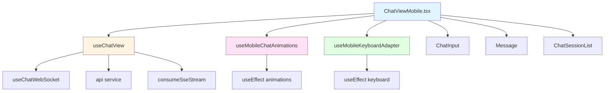

# 1. 问题

ChatViewMobile.tsx文件承担了过多的职责，违反了单一职责原则，导致代码难以维护、测试和扩展。该文件约2214行代码，包含了移动端聊天视图的所有逻辑，从UI渲染到复杂的业务逻辑和动画处理。

## 1.1. **职责过度集中**

ChatViewMobile.tsx文件承担了以下多个职责：

- **UI渲染职责**：包含复杂的JSX结构，包括双容器交叉淡入淡出动画、侧边栏、消息列表、输入框等UI组件
- **状态管理职责**：包含30+个useState，管理会话、消息、输入、流式状态、附件、建议、删除模式、动画状态等
- **业务逻辑职责**：包含消息发送、流式处理、WebSocket处理、会话管理、消息编辑删除等业务逻辑
- **动画逻辑职责**：包含欢迎动画、会话切换动画、淡入淡出动画、键盘适配动画等复杂的动画逻辑
- **移动端适配职责**：包含iOS Safari适配、键盘适配、dock适配等移动端特定的适配逻辑

## 1.2. **代码重复严重**

ChatViewMobile.tsx与ChatView\.tsx、ChatViewDesktop.tsx之间存在大量重复代码：

- 流式处理逻辑在三个文件中重复实现
- WebSocket处理逻辑在三个文======================================================================00珀魄9-=p-------------------------------------008件中重复实现
- 消息发送逻辑在三个文件中重复实现
- 会话管理逻辑在三个文件中重复实现

这些重复代码不仅增加了维护成本，还可能导致不一致的行为。

## 1.3. **复杂的移动端动画逻辑**

ChatViewMobile.tsx包含了复杂的移动端动画逻辑：

- 欢迎动画：runWelcomeInputDropAnimation函数约50行，处理输入框从欢迎页面移动到dock位置的动画
- 会话切换动画：handleSelectSession函数约80行，处理会话切换时的淡入淡出动画
- 键盘适配动画：多个useEffect处理键盘打开/关闭时的UI适配
- 双容器交叉淡入淡出：为了解决iOS Safari DOM切换闪烁问题，实现了复杂的双容器动画逻辑

这些动画逻辑与业务逻辑混合在一起，使得代码难以理解和维护。

## 1.4. **状态管理混乱**

ChatViewMobile.tsx包含了30+个useState，这些状态之间存在着复杂的依赖关系：

- 会话相关状态：sessions、activeSessionId、sessionVisualSnapshot等
- 消息相关状态：messages、input、suggestions、streamStatus等
- UI相关状态：sidebarCollapsed、welcomeDropping、newSessionFadeState等
- 动画相关状态：welcomeDropDistance、composerBottomOffset等
- 删除相关状态：isDeleteMode、selectedSessions、showDeleteConfirm等

这些状态的管理逻辑分散在文件的各个地方，难以追踪状态的变化和依赖关系。

## 1.5. **测试困难**

由于职责过度集中，ChatViewMobile.tsx难以进行单元测试：

- UI渲染、业务逻辑、动画逻辑混合在一起，难以单独测试
- 大量的内部状态和复杂的依赖关系，难以设置测试环境
- 移动端特定的逻辑（如动画、键盘适配）难以在测试环境中模拟

# 2. 收益

通过重构ChatViewMobile.tsx，将职责分离到不同的模块和自定义hook中，可以带来以下收益：

## 2.1. **降低代码复杂度**

- 将ChatViewMobile.tsx从2214行减少到约800-1000行，代码量减少约60%
- 将30+个useState减少到约10个，状态管理复杂度降低约70%
- 将圈复杂度从估计的30+降低到约10-15，代码可读性显著提升

## 2.2. **提高代码可维护性**

- 职责分离后，每个模块和hook都有明确的职责，修改某个功能时只需要关注相关的模块
- 减少代码重复，修改某个功能时只需要修改一处，避免遗漏
- 清晰的模块划分使得新开发者更容易理解代码结构

## 2.3. **提高代码可测试性**

- 业务逻辑提取到自定义hook后，可以单独进行单元测试
- UI组件专注于渲染，可以进行组件测试
- 动画逻辑提取到专门的hook后，可以模拟动画行为进行测试

## 2.4. **提高代码复用性**

- 提取的自定义hook可以在其他聊天视图组件中复用
- 通用的业务逻辑可以在ChatView\.tsx、ChatViewDesktop.tsx中复用
- 移动端特定的逻辑可以在其他移动端组件中复用

## 2.5. **改善开发体验**

- 更清晰的代码结构使得IDE的代码导航和智能提示更加准确
- 更小的文件使得代码加载和编译速度更快
- 更好的模块划分使得团队协作更加高效

# 3. 方案

采用分层架构和自定义hook的方式，将ChatViewMobile.tsx的职责分离到不同的模块中。整体方案如下：

## 3.1. **提取业务逻辑到useChatView hook**

将通用的聊天业务逻辑提取到useChatView hook中，包括：

- 会话管理（sessions、activeSessionId）
- 消息管理（messages、input、suggestions）
- 流式处理（streamStatus、queueInfo）
- WebSocket处理
- 消息发送、编辑、删除等业务逻辑

这样可以在ChatView\.tsx、ChatViewMobile.tsx、ChatViewDesktop.tsx中复用相同的业务逻辑，避免代码重复。

## 3.2. **提取移动端动画逻辑到useMobileChatAnimations hook**

将移动端特定的动画逻辑提取到useMobileChatAnimations hook中，包括：

- 欢迎动画（welcomeDropping、welcomeDropDistance、welcomeDropSnapshot）
- 会话切换动画（newSessionFadeState、sessionVisualSnapshot）
- 淡入淡出动画逻辑

这样可以将动画逻辑与业务逻辑分离，使得代码更加清晰。

## 3.3. **提取移动端适配逻辑到useMobileKeyboardAdapter hook**

将移动端特定的适配逻辑提取到useMobileKeyboardAdapter hook中，包括：

- 键盘适配（isKeyboardOpen、composerBottomOffset）
- dock适配
- iOS Safari特定的适配逻辑

这样可以将适配逻辑与业务逻辑分离，使得代码更加清晰。

## 3.4. **简化ChatViewMobile组件**

将ChatViewMobile组件简化为纯UI组件，只负责：

- 渲染UI结构
- 调用自定义hook获取状态和方法
- 处理用户交互事件

这样可以将UI渲染与业务逻辑分离，使得组件更加简洁。

## 3.5. **代码示例**

### 修改前的代码结构

```typescript
// ChatViewMobile.tsx - 2214行，包含所有职责
export const ChatViewMobile: React.FC<ChatViewProps> = ({ ... }) => {
  // 30+个useState
  const [sessions, setSessions] = useState<Session[]>([]);
  const [activeSessionId, setActiveSessionId] = useState<string | null>(null);
  const [messages, setMessages] = useState<MessageType[]>([]);
  const [input, setInput] = useState('');
  const [streamStatus, setStreamStatus] = useState<StreamStatus>('idle');
  // ... 更多状态

  // 业务逻辑
  const handleSend = async (overrideText?: string) => {
    // 复杂的发送逻辑，包含流式处理、WebSocket处理等
  };

  const handleSelectSession = (session: any) => {
    // 复杂的会话切换逻辑，包含动画处理
  };

  // 动画逻辑
  const runWelcomeInputDropAnimation = useCallback((seedText: string) => {
    // 复杂的欢迎动画逻辑
  }, []);

  // 移动端适配逻辑
  useEffect(() => {
    // 复杂的键盘适配逻辑
  }, [isKeyboardOpen]);

  // UI渲染
  return (
    <div className="...">
      {/* 复杂的JSX结构 */}
    </div>
  );
};
```

### 修改后的代码结构

```typescript
// hooks/useChatView.ts - 通用聊天业务逻辑
export function useChatView({ currentModel, t }: UseChatViewParams) {
  // 会话管理、消息管理、流式处理等业务逻辑
  const [sessions, setSessions] = useState<Session[]>([]);
  const [activeSessionId, setActiveSessionId] = useState<string | null>(null);
  const [messages, setMessages] = useState<MessageType[]>([]);
  const [input, setInput] = useState('');
  const [streamStatus, setStreamStatus] = useState<StreamStatus>('idle');

  const handleSend = useCallback(async (overrideText?: string) => {
    // 纯粹的业务逻辑，不包含UI和动画
  }, [/* 依赖 */]);

  const handleSelectSession = useCallback((session: any) => {
    // 纯粹的业务逻辑，不包含动画
  }, [/* 依赖 */]);

  return {
    sessions, activeSessionId, messages, input, streamStatus,
    handleSend, handleSelectSession, // ... 其他状态和方法
  };
}

// hooks/useMobileChatAnimations.ts - 移动端动画逻辑
export function useMobileChatAnimations() {
  const [welcomeDropping, setWelcomeDropping] = useState(false);
  const [welcomeDropDistance, setWelcomeDropDistance] = useState(0);
  const [welcomeDropSnapshot, setWelcomeDropSnapshot] = useState(null);
  const [newSessionFadeState, setNewSessionFadeState] = useState('idle');
  const [sessionVisualSnapshot, setSessionVisualSnapshot] = useState(null);

  const runWelcomeInputDropAnimation = useCallback((seedText: string) => {
    // 纯粹的动画逻辑
  }, []);

  const handleSessionSwitchAnimation = useCallback((callback: () => void) => {
    // 纯粹的动画逻辑
  }, []);

  return {
    welcomeDropping, welcomeDropDistance, welcomeDropSnapshot,
    newSessionFadeState, sessionVisualSnapshot,
    runWelcomeInputDropAnimation, handleSessionSwitchAnimation,
  };
}

// hooks/useMobileKeyboardAdapter.ts - 移动端适配逻辑
export function useMobileKeyboardAdapter() {
  const [isKeyboardOpen, setIsKeyboardOpen] = useState(false);
  const [composerBottomOffset, setComposerBottomOffset] = useState(90);

  useEffect(() => {
    // 键盘适配逻辑
  }, [isKeyboardOpen]);

  return {
    isKeyboardOpen, composerBottomOffset,
  };
}

// ChatViewMobile.tsx - 简化后的UI组件
export const ChatViewMobile: React.FC<ChatViewProps> = ({ ... }) => {
  // 调用自定义hook获取状态和方法
  const chatView = useChatView({ currentModel, t });
  const animations = useMobileChatAnimations();
  const keyboardAdapter = useMobileKeyboardAdapter();

  // UI渲染
  return (
    <div className="...">
      {/* 简化的JSX结构，只包含UI渲染 */}
    </div>
  );
};
```

## 3.6. **模块依赖关系图**



# 4. 回归范围

## 4.1. **主链路**

1. **用户发送消息流程**
   - 用户在移动端输入框中输入消息
   - 点击发送按钮
   - 消息显示在聊天界面
   - AI回复消息（流式显示）
   - 建议按钮显示
2. **会话切换流程**
   - 用户点击侧边栏
   - 选择其他会话
   - 会话切换动画正常播放
   - 消息列表正确切换
3. **欢迎页面流程**
   - 用户打开应用
   - 显示欢迎页面
   - 用户输入第一条消息
   - 欢迎动画正常播放
   - 切换到聊天界面

## 4.2. **边界情况**

1. **移动端适配**
   - iOS Safari键盘打开/关闭
   - Android键盘打开/关闭
   - 不同屏幕尺寸的适配
   - 横屏/竖屏切换
2. **网络异常**
   - 网络断开时的错误处理
   - WebSocket连接失败的处理
   - 流式传输中断的处理
3. **动画异常**
   - 动画被中断时的处理
   - 快速切换会话时的动画处理
   - 内存不足时的动画降级
4. **状态异常**
   - 会话不存在时的处理
   - 消息加载失败的处理
   - 附件上传失败的处理

## 4.3. **测试重点**

1. **功能测试**
   - 消息发送、编辑、删除功能
   - 会话切换功能
   - 附件上传功能
   - 流式显示功能
2. **UI测试**
   - 欢迎动画
   - 会话切换动画
   - 淡入淡出动画
   - 键盘适配
3. **兼容性测试**
   - iOS Safari
   - Android Chrome
   - 不同屏幕尺寸
   - 不同网络环境
4. **性能测试**
   - 大量消息时的性能
   - 长时间使用的内存占用
   - 动画流畅度
   - 页面加载速度

