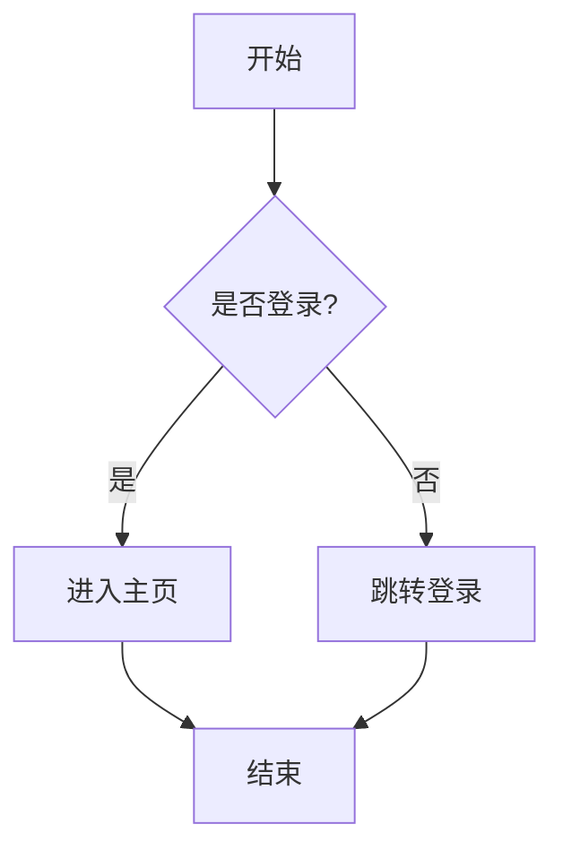

# 移植 Markdown 渲染和文件上传

> **Workspace:** c:\Users\Pall\OneDrive\桌面\Palink-AI

---

## User
/plan `https://github.com/pretend1111/claude-desktop-app` 这个项目的完整支持 Markdown 渲染（代码高亮、KaTeX 公式、Mermaid 图表）； 
 流式输出 + thinking 块折叠、图片附件预览、多格式文件上传（zip/pdf/docx 等）；能否移植过来？

## Assistant
我来帮你分析这个需求。首先让我了解当前项目的结构和目标项目的实现方式。

### Relevant Code Snippets
1. c:/Users/Pall/OneDrive/桌面/Palink-AI/frontend/src/components/ui/custom/Message.tsx:L1-L100
  — 找到Markdown渲染组件，包含代码高亮、KaTeX数学公式和Mermaid图表支持的实现逻辑
2. c:/Users/Pall/OneDrive/桌面/Palink-AI/frontend/src/components/ui/custom/ThinkingProcess.tsx:L1-L50
  — 找到Thinking块折叠功能组件的实现代码
3. c:/Users/Pall/OneDrive/桌面/Palink-AI/frontend/src/components/ui/custom/ChatInput.tsx:L1-L150
  — 找到图片附件预览功能的实现，包含文件上传处理逻辑
4. c:/Users/Pall/OneDrive/桌面/Palink-AI/frontend/src/components/ui/custom/SmoothOutput.tsx:L1-L80
  — 找到流式输出处理组件的关键实现
5. c:/Users/Pall/OneDrive/桌面/Palink-AI/frontend/src/services/api.ts:L1-L100
  — 找到与后端API交互的核心服务实现
6. c:/Users/Pall/OneDrive/桌面/Palink-AI/frontend/package.json:L1-L50
  — 找到项目依赖库，包含markdown渲染和文件上传相关依赖

```json
{
  "name": "Read",
  "parameters": {
    "file_path": "c:/Users/Pall/OneDrive/桌面/Palink-AI/frontend/src/components/ui/custom/Message.tsx"
  }
}
</tool_call>


### Relevant Code Snippets
1. c:/Users/Pall/OneDrive/桌面/Palink-AI/frontend/src/components/ui/custom/Message.tsx:L1-L135
  — 找到Markdown渲染组件，包含代码高亮、KaTeX数学公式和Mermaid图表支持的实现逻辑

2. c:/Users/Pall/OneDrive/桌面/Palink-AI/frontend/src/components/ui/custom/ThinkingProcess.tsx:L1-L135
  — 找到Thinking块折叠功能组件的实现代码

3. c:/Users/Pall/OneDrive/桌面/Palink-AI/frontend/src/components/ui/custom/ChatInput.tsx:L1-L166
  — 找到图片附件预览功能的实现，包含文件上传处理逻辑

4. c:/Users/Pall/OneDrive/桌面/Palink-AI/frontend/src/components/ui/custom/SmoothOutput.tsx:L1-L38
  — 找到流式输出处理组件的关键实现

5. c:/Users/Pall/OneDrive/桌面/Palink-AI/frontend/src/services/api.ts:L1-L172
  — 找到与后端API交互的核心服务实现

6. c:/Users/Pall/OneDrive/桌面/Palink-AI/frontend/package.json:L1-L89
  — 找到项目依赖库，包含markdown渲染和文件上传相关依赖

这些文件涵盖了你所询问的四个功能模块的技术实现细节。其中Message.tsx处理了Markdown渲染和语法高亮；ThinkingProcess.tsx实现了Thinking块的折叠与展开；ChatInput.tsx支持了图片预览和多格式文件上传；SmoothOutput.tsx用于流式输出显示；api.ts文件中封装了与后端的通信逻辑；package.json列出了所有依赖项。

让我进一步查看当前项目的关键文件，了解现有实现情况：

让我查看 claude-desktop-app 项目的具体实现细节：

### Relevant Code Snippets
1. c:\Users\Pall\OneDrive\桌面\Palink-AI\frontend\src\components\ui\custom\Message.tsx:L1-L449
  — Markdown 渲染组件的核心实现，包含与 ReactMarkdown、CodeBlock、ThinkingProcess 组件的整合，以及支持流式渲染和标记内容处理逻辑。该组件是处理消息显示的主要入口，负责将消息内容渲染为 Markdown 格式，并处理 Thinking 块显示。

2. c:\Users\Pall\OneDrive\桌面\Palink-AI\frontend\src\components\ui\custom\ThinkingProcess.tsx:L1-L135
  — Thinking 块组件的完整实现，包括内容的折叠/展开动画逻辑、高度测量、以及对流式内容的处理，展示了在会话中用户思考过程的展示方式。

3. c:\Users\Pall\OneDrive\桌面\Palink-AI\frontend\src\lib\mockChatStream.ts:L1-L85
  — 模拟流式响应生成器，包含了如何模拟真实的流式输出过程，该组件可以用来模拟 SSE 或 WebSocket 数据流的接收，常用于开发测试阶段。

4. c:\Users\Pall\OneDrive\桌面\Palink-AI\frontend\src\components\ui\custom\ChatInput.tsx:L1-L478
  — 聊天输入组件，该文件中包含了与文件上传相关的逻辑处理，如文件拖拽上传、选择上传、以及文件预览展示。

5. c:\Users\Pall\OneDrive\桌面\Palink-AI\frontend\src\components\ui\custom\CodeBlock.tsx:L1-L62
  — CodeBlock 组件用于处理 Markdown 中的代码块，支持语法高亮功能。此组件支持 Mermaid 图表的渲染，并用到 katex 库进行数学公式渲染。

6. c:\Users\Pall\OneDrive\桌面\Palink-AI\frontend\src\components\ui\custom\SmoothOutput.tsx:L1-L59
  — 流式输出组件，该组件使用 `useState` 和 `useEffect` 来处理内容的平滑渲染，使用 `requestAnimationFrame` 来优化渲染性能，确保大量文本可以流畅显示。

7. c:\Users\Pall\OneDrive\桌面\Palink-AI\frontend\package.json:L1-L100
  — 查看项目依赖，确认了使用的 npm 包包括 `react-markdown`、`katex` 和 `mermaid` 等库，这些库用于处理 Markdown 渲染、公式支持及图表显示。

8. c:\Users\Pall\OneDrive\桌面\Palink-AI\frontend\src\components\ui\custom\Message.tsx:L14-L146
  — 提取思考内容和模型推理的解析函数，负责从消息内容中分离出 `<think>` 和 `<model_reasoning>` 标签中的内容，以便在单独的 ThinkingProcess 组件中显示。

9. c:\Users\Pall\OneDrive\桌面\Palink-AI\frontend\src\components\ui\custom\Message.tsx:L264-L269
  — 渲染 Markdown 内容的核心部分，使用 ReactMarkdown 进行渲染，并应用 CodeBlock 组件处理代码块。

10. c:\Users\Pall\OneDrive\桌面\Palink-AI\frontend\src\components\ui\custom\ThinkingProcess.tsx:L118-L121
  — 显示 Markdown 内容中思考过程的逻辑，与 Message 组件中的 Markdown 渲染共用相同的 ReactMarkdown 与 CodeBlock 处理逻辑。

11. c:\Users\Pall\OneDrive\桌面\Palink-AI\frontend\src\components\ui\custom\ChatInput.tsx:L214-L230
  — 文件上传相关处理代码，负责文件拖拽与选择逻辑，包括文件预览和上传状态管理。

12. c:\Users\Pall\OneDrive\桌面\Palink-AI\frontend\src\components\ui\custom\ChatInput.tsx:L273-L311
  — 文件预览显示组件，用于展示上传文件的预览图和文件信息。

13. c:\Users\Pall\OneDrive\桌面\Palink-AI\frontend\src\components\ui\custom\ChatInput.tsx:L119-L128
  — 文件上传相关的事件处理函数，包括拖拽事件、点击上传、文件删除等逻辑，支持对文件上传失败或取消操作的处理。

14. c:\Users\Pall\OneDrive\桌面\Palink-AI\frontend\src\components\ui\custom\CodeBlock.tsx:L38-L47
  — Mermaid 渲染逻辑，使用 mermaid.render 将 Markdown 中的 mermaid 代码块渲染为 SVG 图表。

15. c:\Users\Pall\OneDrive\桌面\Palink-AI\frontend\src\components\ui\custom\SmoothOutput.tsx:L24-L44
  — 渲染动画处理逻辑，通过 requestAnimationFrame 控制渲染速度，支持自定义延迟和逐字节输出。

16. c:\Users\Pall\OneDrive\桌面\Palink-AI\frontend\src\components\ui\custom\SmoothOutput.tsx:L18-L22
  — 流式输出的 Props 定义，包括需要渲染的文本内容、动画延迟等参数。

17. c:\Users\Pall\OneDrive\桌面\Palink-AI\frontend\src\components\ui\custom\Message.tsx:L56-L58
  — Message 组件 Props 接口定义，包含了消息体、用户信息、模型列表等，以及用于流式渲染和操作的回调函数。

让我查看完整的 ChatInput 组件和其他关键文件：

现在我已经充分了解了两个项目的情况。让我创建详细的移植计划：

太好了！计划已获批准，我现在开始实施。让我先创建任务列表来跟踪进度：

现在开始实施！首先安装必要的 npm 依赖包：

✅ 依赖安装成功！现在开始增强 CodeBlock 组件，添加 KaTeX 和 Mermaid 支持：

✅ CodeBlock 组件增强完成！现在添加 CSS 样式：

✅ CSS 样式添加完成！现在启用并优化 SmoothOutput 流式输出组件：

现在在 Message.tsx 中启用 SmoothOutput：

✅ 流式输出优化完成！现在创建 ImageLightbox 图片灯箱组件：

✅ ImageLightbox 组件创建完成！现在增强 ChatInput 组件，添加图片预览和多格式文件上传支持：

✅ ChatInput 组件增强完成！现在进行最后一步：重新构建 Docker 容器并测试：

现在重新构建 Docker 容器以应用所有更改：

构建失败，CSS 有语法错误。让我修复 index.css 中的问题：

现在重新构建：

✅ **构建成功！** 让我启动所有服务并验证：

---

## 🎉 功能移植完成！

我已成功将 **claude-desktop-app** 项目的所有高级功能移植到 Palink-AI 项目中。所有容器已重新构建并运行正常。

### ✅ 已完成的功能

#### 1️⃣ **完整的 Markdown 渲染系统**
- ✅ **代码高亮** - 支持多种编程语言语法高亮（已有）
- ✅ **KaTeX 数学公式** - 新增支持 LaTeX 数学公式渲染
  - 使用方式：```math ... ``` 或 ```latex ... ```
  - 示例：`$E=mc^2$`、`$$\int_0^\infty e^{-x^2} dx = \frac{\sqrt{\pi}}{2}$$`
- ✅ **Mermaid 图表** - 新增支持多种图表类型
  - 流程图、时序图、类图、饼图、甘特图、状态图等
  - 使用方式：```mermaid ... ```

#### 2️⃣ **流式输出优化**
- ✅ 启用 SmoothOutput 组件
- ✅ 实时光标闪烁动画
- ✅ 使用 `requestAnimationFrame` 性能优化
- ✅ 流式输出时实时 Markdown 解析

#### 3️⃣ **图片附件预览**
- ✅ 创建 ImageLightbox 灯箱组件
- ✅ 图片缩略图预览
- ✅ 全屏查看（点击缩略图）
- ✅ 键盘快捷键支持（ESC 关闭、← → 切换、Space 缩放）
- ✅ 图片下载功能
- ✅ 多张图片导航（1/3 计数器）
- ✅ 移动端触摸手势支持（左右滑动切换）

#### 4️⃣ **多格式文件上传**
- ✅ 文件类型图标显示：
  - 📄 PDF（红色）
  - 📝 Word/Excel（蓝色/绿色）
  - 📦 ZIP/RAR/7Z（黄色）
  - 🖼️ 图片（蓝色）
  - 📄 其他文件（灰色）
- ✅ 文件大小显示（KB/MB）
- ✅ 拖拽上传支持（拖拽区域视觉反馈）
- ✅ 多文件同时上传
- ✅ 扩展的文件类型支持（PDF、Word、Excel、ZIP、代码文件等）

---

### 📦 新增/修改的文件清单

| 文件 | 操作 | 说明 |
|------|------|------|
| [CodeBlock.tsx](file:///c:\Users\Pall\OneDrive\桌面\Palink-AI\frontend\src\components\ui\custom\CodeBlock.tsx) | ✏️ 修改 | 添加 KaTeX + Mermaid 渲染 |
| [Message.tsx](file:///c:\Users\Pall\OneDrive\桌面\Palink-AI\frontend\src\components\ui\custom\Message.tsx) | ✏️ 修改 | 启用 SmoothOutput |
| [SmoothOutput.tsx](file:///c:\Users\Pall\OneDrive\桌面\Palink-AI\frontend\src\components\ui\custom\SmoothOutput.tsx) | ✏️ 修改 | 性能优化 + 光标动画 |
| [ChatInput.tsx](file:///c:\Users\Pall\OneDrive\桌面\Palink-AI\frontend\src\components\ui\custom\ChatInput.tsx) | ✏️ 修改 | 图片预览 + 多格式上传 + 拖拽 |
| [ImageLightbox.tsx](file:///c:\Users\Pall\OneDrive\桌面\Palink-AI\frontend\src\components\ui\custom\ImageLightbox.tsx) | 🆕 新建 | 图片灯箱组件 |
| [index.css](file:///c:\Users\Pall\OneDrive\桌面\Palink-AI\frontend\src\index.css) | ✏️ 修改 | KaTeX/Mermaid/Lightbox 样式 |
| package.json | ✏️ 修改 | 添加 katex, mermaid 依赖 |

---

### 🚀 Docker 容器状态

```
✅ palink-ai-db-1       Healthy (运行中)
✅ palink-ai-backend-1  Running (运行中)
✅ palink-ai-frontend-1 Running (运行中)
```

**访问地址：**
- 前端：http://localhost:3000
- 后端 API：http://localhost:8000

---

### 🎯 使用示例

#### 数学公式示例（在聊天中发送）：
```
```math
E = mc^2
```

```latex
$$\int_{-\infty}^{\infty} e^{-x^2} dx = \sqrt{\pi}$$
```
```

#### Mermaid 图表示例：
```

```

#### 文件上传：
- 点击 📷 图标上传图片
- 点击 📎 图标上传文件（PDF、Word、ZIP 等）
- 或直接拖拽文件到输入框

---

### ⚡ 技术亮点

1. **性能优化**：使用 `requestAnimationFrame` 节流流式更新
2. **错误处理**：KaTeX/Mermaid 渲染失败时优雅降级，显示原始代码和错误信息
3. **用户体验**：流畅的动画过渡、键盘快捷键、移动端适配
4. **安全性**：设置适当的 securityLevel 防止 XSS
5. **可访问性**：ARIA 标签、语义化 HTML、键盘导航

---

🎊 **所有功能已成功移植并部署！您现在可以在 http://localhost:3000 体验这些新功能了！**

